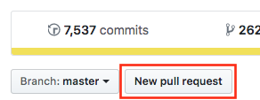

# Welcome!

We're building a game based on [Zedeck Siew's](http://zedecksiew.tumblr.com/) story _[The White Mask](https://www.amazon.com/Cyberpunk-Malaysia-Various-ebook/dp/B01GPCENNG/ref=sr_1_1_twi_kin_2)_.

<new-people/>

## Pitch

In the near future, artists using an advanced new tech called smart graffiti - living street art that can watch, listen to, and interact with its surroundings - have a responsibility to know everything they can about how their art communicates with the living world. Since the tech has skyrocketed in popularity and potential, opportunity abounds for hijacking and misusing the art, especially with the enormous money and power that oppressive governments and their supporters can bring to bear.

This is where you come in.

You're a hacker whose experience with smart graffiti lets you find all the vulnerabilities any mural has left exposed - open doors, poor security, and more are all ready to be patched up for good after you put murals through every trial you can think of.

Stay one step ahead of malicious hackers, government and otherwise, as you protect artists, their audience, and their work, sneaking a glimmer of hope into a cruel and controlled world.

## Tech Details

|               |                                                    |
| ------------- | -------------------------------------------------- |
| Unity version | 2018.2.0f2                                         |
| Repo URL      | keybase://team/whitemaskgame/white-mask            |
| Task Board    | [Trello](https://trello.com/b/pQkYudAl/white-mask) |

## Contributing

Interested in making a change/contribution to these docs? First of all, thanks - the more eyes on them, the better!

### OSX

**Skip to the next section if you already have Git and Node installed. If you don't or you're not sure, keep reading.**

1.  Press Cmd+Space and open the program Terminal.
1.  Type `git --version` and hit Enter.
    1.  If you don't have Git installed, you'll see an error at this point - head over to [the Git website](https://git-scm.com/downloads) and download the software.
1.  Type `node --version` and hit Enter.
    1.  If you don't have Node installed, you'll see an error at this point - head over to [the Node website](https://git-scm.com/downloads) and download the software.
1.  Set up an account on [Github](https://github.com) if you don't already have one.

**Now we're assuming that Git and Node are installed - `git --version` and `node --version` don't show errors when run.**

1.  In your web browser, head to [the repo](https://github.com/SaFrMo/wm-builder) for this site. Click the "Fork" button in the top right corner.
    1.  Forking creates your own copy of a repo, which you can edit however you like. Eventually, you can request that the repo owner pull in your changes (called a "Pull Request").
1.  Github should automatically redirect you to the new, forked repo when it's created. Copy the URL of this repo - it'll be the same `wm-builder` name, just under your Github user name.
1.  If you don't have Terminal open already, press Cmd+Space and open it.
1.  Navigate to the location where you want the working files kept. For example, `cd ~/` or `cd ~/misc`.
1.  Enter `git clone` and the pasted URL of your forked repo, then hit Enter.
1.  After the forked repo has finished cloning to your machine, enter `cd wm-builder` and hit enter.
1.  Enter `npm install` and hit enter. This will install the necessary files. (It's okay if there are some security warnings about the packages in use - these are from dependencies and are acceptable errors.)

**Now you've got your local installation up and running, so you'll refer to the next section now and when making future changes.**

1.  In the Terminal, navigate to your `wm-builder` folder and run `npm run docs:dev`.
1.  You should see a notice about the "VuePress dev server listening at localhost:8080". If not, try running `npm install` again.
1.  Open up `localhost:8080` in your browser.
1.  Make changes to any README.md files in the `docs/` directory in the `wm-builder` folder. When you save those changes, you should immediately see your browser reload with the new information in place.
1.  Edit, save, commit, and push like you normally would!

**When you're ready to see your changes merged into the live website, you'll make a _pull request_ (PR):**

1.  Go to [the main repo](https://github.com/SaFrMo/wm-builder). You'll see a "New pull request" button below the code summary:

    

1.  Click on this button and follow the [new pull request](https://help.github.com/articles/creating-a-pull-request/) instructions.
1.  Submit your new PR and wait for review!

## Code of Conduct

Adopted from the Golang Code of Conduct.

### Sumary

The team behind The White Mask is dedicated to providing a harassment-free working environment for all, regardless of gender, sexual orientation, disability, physical appearance, body size, race, or religion. We do not tolerate harassment of any form. All communication should be appropriate for a professional audience including people of many different backgrounds.

Sexual language and imagery is not appropriate for any communication and/or talks. Be kind and do not insult or put down others. Behave professionally. Remember that harassment and sexist, racist, or exclusionary jokes are not appropriate for White Mask. Staff violating these rules should be reported to an appropriate line manager.

These are the values to which people in the White Mask community should aspire:

-   Be friendly and welcoming
-   Be patient
    -   Remember that people have varying communication styles and that not everyone is using their native language. (Meaning and tone can be lost in translation.)
-   Be thoughtful
    -   Productive communication requires effort. Think about how your words will be interpreted.
    -   Remember that sometimes it is best to refrain entirely from commenting.
-   Be respectful
    -   In particular, respect differences of opinion.
-   Be charitable
    -   Interpret the arguments of others in good faith, do not seek to disagree.
    -   When we do disagree, try to understand why.
-   Avoid destructive behavior:
    -   Derailing: stay on topic; if you want to talk about something else, start a new conversation.
    -   Unconstructive criticism: don't merely decry the current state of affairs; offer—or at least solicit—suggestions as to how things may be improved.
    -   Snarking (pithy, unproductive, sniping comments)
    -   Discussing potentially offensive or sensitive issues; this all too often leads to unnecessary conflict.
    -   Microaggressions: brief and commonplace verbal, behavioral and environmental indignities that communicate hostile, derogatory or negative slights and insults to a person or group.

People are complicated. You should expect to be misunderstood and to misunderstand others; when this inevitably occurs, resist the urge to be defensive or assign blame. Try not to take offense where no offense was intended. Give people the benefit of the doubt. Even if the intent was to provoke, do not rise to it. It is the responsibility of all parties to de-escalate conflict when it arises.

### Reporting an incident

Incidents that violate the Code of Conduct are extremely damaging to the White Mask, and they will not be tolerated. The silver lining is that, in many cases, these incidents present a chance for the offenders, and the teams at large, to grow, learn, and become better.

> The following should be handled by a line manager who has been informed of the incident

Try to get as much of the incident in written form. The important information to gather include the following:

-   Name and team of the participant doing the harassing
-   The location in which the incident occurred
-   The behavior that was in violation
-   The approximate time of the behavior
-   The circumstances surrounding the incident
-   Other people involved in the incident

Depending on the severity/details of the incident, please follow these guidelines:

-   If there is any general threat to staff or any other doubts, summon security or police
-   Offer the victim a private place to sit
-   Ask "is there a friend or trusted person who you would like to be with you?" (if so, arrange for someone to fetch this person)
-   Ask them "how can I help?"
-   Provide them with your list of emergency contacts if they need help later
-   If everyone is presently physically safe, involve the police or security only at a victim's request

There are also some guidelines as to what not to do as an initial response:

-   Do not overtly invite them to withdraw the complaint or mention that withdrawal is OK. This suggests that you want them to do so, and is therefore coercive. "If you're OK with pursuing the complaint" suggests that you are by default pursuing it and is not coercive.
-   Do not ask for their advice on how to deal with the complaint. This is a staff responsibility.
-   Do not offer them input into penalties. This is the staff's responsibility.

The line manager who is handling the reported offence should find out the following:

-   What happened?
-   Are we doing anything about it?
-   Who is doing those things?
-   When are they doing them?

After the above has been identified and discussed, have an appropriate line manager communicate with the alleged harasser. Make sure to inform them of what has been reported about them.

Allow the alleged harasser to give their side of the story. After this point, if the report stands, let the alleged harasser know what actions will be taken against them.

Some things for the staff to consider when dealing with Code of Conduct offenders:

-   Warning the harasser to cease their behaviour and that any further reports will result in sanctions
-   Requiring that the harasser avoid any interaction with, and physical proximity to, their victim until a resolution or course of action has been decided upon
-   Requiring that the harasser not volunteer for future events your organisation runs (either indefinitely or for a certain time period)
-   Depending on the severity/details of the incident, requiring that the harasser immediately be sent home
-   Depending on the severity/details of the incident, removing a harasser from membership of relevant White Mask organisations
-   Depending on the severity/details of the incident, publishing an account of the harassment and calling for the resignation of the harasser from their responsibilities (usually pursued by people without formal authority: may be called for if the harasser is a team leader, or refuses to stand aside from the conflict of interest)

Give accused staff members a place to appeal to if there is one, but in the meantime the report stands. Keep in mind that it is not a good idea to encourage an apology from the harasser.

It is very important how we deal with the incident publicly. Our policy is to make sure that everyone aware of the initial incident is also made aware that it is not according to policy and that official action has been taken - while still respecting the privacy of individual staff members. When speaking to individuals (those who are aware of the incident, but were not involved with the incident) about the incident it is a good idea to keep the details out.

Depending on the incident, the head of responsible department, or designate, may decide to make one or more public announcements. If necessary, this will be done with a short announcement either during the plenary and/or through other channels. No one other than the head of responsible department or someone delegated authority from them should make any announcements. No personal information about either party will be disclosed as part of this process.

If some members of staff were angered by the incident, it is best to apologise to them that the incident occurred to begin with. If there are residual hard feelings, suggest to them to write an email to the responsible head of department. It will be dealt with accordingly.

### Attribution

This Code of Conduct was adapted from both [Golang](https://golang.org/conduct) an the [Golang UK Conference](http://golanguk.com/conduct/).
