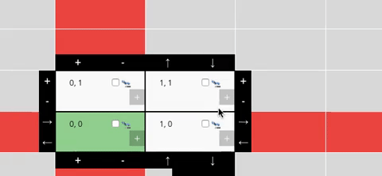

# Level Builder Documentation

The White Mask [level builder](https://white-mask.com/builder/ 'Level builder') is a tool for creating White Mask levels. The level builder is an in-browser tool that can export levels to be added to the Unity project and import levels for editing.

## Layout

### Level Information

#### Board Name

The current board's name, which is used to name the exported file and on the level selection menu once the level is loaded into the Unity project.

#### Meta

Extra information about the board, such as descriptions or trivia.

### View Controls

#### View Movement

Controls the movement of the view of the board. The keyboard arrow keys can also be used to move the view of the board.

#### Zoom

'+' Zooms in on the board

'-' Zooms out from the board

#### Recenter

Centers the view on the board origin and resets the zoom to default.

#### New Board

Clears all changes to and information on the board, resetting the level and builder back to its initial state.

### Exporting and Importing

#### Export Level

Export the level as a JSON file for use in Unity.

#### Import Level

Import a level for editing.

### The Board

#### Origin

The origin, coordinates (0, 0), of the board is highlighted black.

#### Axes

The x and y axes and all multiples of five along them are highlighted red.

### Actions and Settings

Each of these menus are used to set up the movement of the board and various options to change game play, such as goals and player items. Each will be covered in depth in their respective sections.

## Saving Progress

The level builder auto-saves your work to `localstorage` every five seconds. More information on `localstorage` can be found at this [reference](https://developer.mozilla.org/en-US/docs/Web/API/Window/localStorage). In short, progress is saved frequently and will be persistent across browser sessions, so it will still be there even if the browser tab or window is closed.

## Building a Level

### Name and Details

The board name is used to identify your level within the game.  The meta information gives information about the level and can be used to add details.

#### Change Name

To change the board name, click inside of the board name box and type the desired name.

#### Add Meta Information

To add meta data, click the "Add More Info" button.

  

Meta information is stored as a `KeyValuePair`.  Each piece of information will need a label (the `key`) and info (the `value`).

Enter the information and an appropriate key into the corresponding boxes.

To remove an item of meta info, click the box with the "x".

##### Meta Trivia

Any item of meta information with the label "trivia" will appear on loading screens and in the "more info" lists in the level section.

The "trivia" key is not case sensitive.

### Partitions

A partition is a discrete segment of the board, made up of cells.  Partitions are always rectangular.

#### Coordinates

Partitions have their own local set of coordinates, shown in the upper left corner of each cell.

#### Creation

To create a new partition, click on any cell on the board that does not already contain a cell of a partition.  The selected cell will be the origin of a new 2x2 partition.

#### Edit Info

Hovering over a partition brings up the surrounding partition controls overlay.  In the lower right corner of the overlay is the "Edit Info" button, which will bring up the partition info editor, from which it is possible to rename the partition and delete it.

##### Naming

After clicking "Edit Info" on the partition, click on the word "Partition" to rename your partition.

It is recommended to give partitions unique and descriptive names immediately upon creating them.  Renaming a partition at a later time can cause errors in Board States and Sequences.

##### Deleting

To delete a partition, after clicking "Edit Info", click on "Delete", then confirm by clicking "Yes".

#### Resizing

A partition can be resized using the '+' and '-' buttons on the partition control overlay.

Although there are resizing buttons on all sides of a partition, it is recommended to use only the top and right controls to resize vertically and horizontally, respectively.  Using the bottom and left resizing controls can have unexpected and adverse effects on the partition's coordinates.

#### Moving

A partition can be moved using the arrow buttons on the partition control overlay.

#### Shaping

While all partitions are technically rectangular, it is possible to reshape them for all intents and purposes by adding an "Empty Space" item to a cell.  This prevents the cell from rendering in-game.  Items and occupants are discussed in greater detail in a later section.

To add an "Empty Space" item, click on the '+' within the cell that you do not want to render, then select "Empty Space".

To remove an "Empty Space" item from a cell, click on the area where the '+' was previously.

#### Deployable Cells

 

It is possible to limit which cells of a partition the player is able to deploy their units to.  Clicking the checkbox in a cell makes it a deployable cell.

If no cells are marked as deployable, then all cells can be deployed to.  This is the default state.

## To be continued
