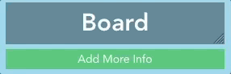

# Building Levels

The [level builder](https://white-mask.com/builder) is designed to make creating White Mask (WM) levels as easy as possible. Let's get started creating our own stages!

## Layout

When you load the builder, you'll see something like this:

The WM Builder is divided into three sections: **meta**, **map**, and **actions**.

Let's go through these one at a time.

## Meta

"Meta" in this case refers to extra information about the board - the board's name and any arbitrary information that should be attached to it.

We're going to set the board's name first. This is what will appear when we select the board in the main menu. Click "Board" in the upper left hand corner and change the text to "Mona Lisa."

Now, let's add some arbitrary information to this board - for example, the fact that it was painted in the early 16th century.

Any arbitrary information needs a _key_ which it will be stored under, as well as a _value_ which contains the information itself. Click "Add More Info" and enter "Trivia" as the key and "Painted in the early 16th century" as the value.

Anything marked "Trivia" (or "trivia," or "tRiViA," and so on - this particular key is case-insensitive) will display on loading screens and in "more info" lists in the level selection.

This is a great start! We can add information that will be displayed to the player in this meta section, as well as information relevant only to the developer - whatever we want.

The board is autosaved every few seconds in your browser, too, so you don't need to worry about constantly keeping your data up to date. (We'll cover exporting data a little later, once we've got more to export.)

Let's jump over to the Map and keep going.

## Map

The first thing you'll see is the large blue rectangle in the center of the map:

This is a **Partition** - a section of the game board that can move and react to its environment.

Partitions usually (but not always!) correspond to a section of the mural they contain.

## TODO: Continue
