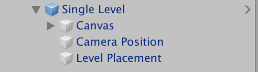

## Concourse

A Concourse is a prefab that contains level information for a single mural. It lives in `Resources/management/concourses` and contains:

-   A single location, optionally with different conditions (for example, different times of day or weather)
-   One or more levels on zoomed-in sections of the mural
-   (Optional) One or more levels starting locked and requiring defeating other levels to unlock
-   (Optional) A final "boss fight" consisting of the mural as a whole

### Creation

To create a Concourse in Unity:

1.  Clone the existing Template Concourse ()`Assets/Resources/management/concourses/Template`).
1.  Set the Concourse parameters on the Mural Concourse GameObject:
    

    1.  The `Unity Scene` that should be additively loaded when this Concourse is loaded (ie, the scene that contains the model of the mural and its art)
    1.  The `Camera Start Position`, where the camera will snap to when loading this Concourse (use the existing Transform and move to the desired position and rotation)
    1.  The `Progression` of the Concourse (see below)

    Ignore any values below the `Automatically Set` header.

### Levels and Progression

1.  Head over to the `Concourse Wrapper` GameObject:
    

    1.  Duplicate the `Single Level` prefab as needed, once per level in the Concourse.

1.  Head over to the `Mural Progression` field:
    

    Each level from the previous step should exist as a `Node` with:

    1.  A human-readable `Label` (just for in-editor use)
    1.  A reference to the `LevelInfo` (see below) this `Node` contains information about
    1.  A list of references to `LevelInfo`s that must be beaten before this `Node` is unlocked. (If none are set, this `Node` starts unlocked)

    Ignore the `Completed` field.

1.  Finally, in each `Single Level`, head to the `Level Placement` GameObject.
    

    1.  Place each `Canvas` and `Camera Position` where you want the level to appear in the Concourse. (It's usually helpful to load the prefab into the 3D scene you have in mind for this step.)
    1.  Place and size the Level Placement mesh using ProBuilder to correspond with the total level play area. (You can also load the level in-game and size/rotate/place this mesh to place it in real time - make sure to copy the mesh before quitting play mode!)

### Other

1.  _Optionally_, you can add the `MainCamera` tag to the included Camera to use any custom background colors, skyboxes, etc. If no `MainCamera`-tagged camera is created in the concourse, the game will fall back to the default camera.
