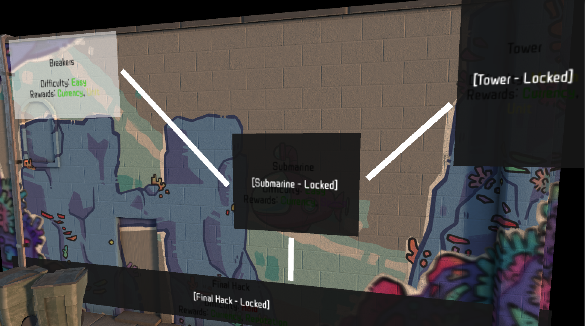
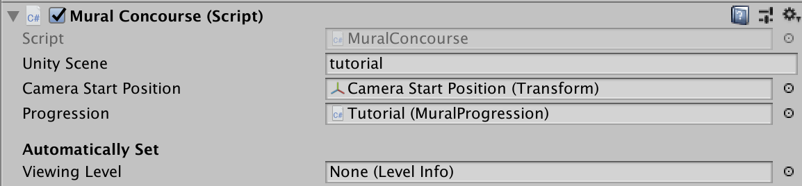
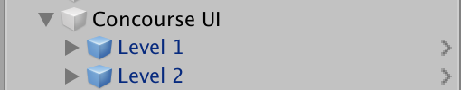
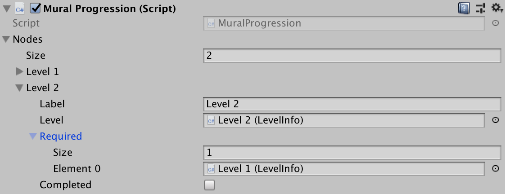
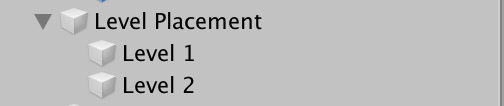

## Concourse

A Concourse is a prefab that contains level information for a single mural. It lives in `Resources/management/conconourses` and contains:

-   A single location, optionally with different conditions (for example, different times of day or weather)
-   One or more levels on zoomed-in sections of the mural
-   (Optional) One or more levels starting locked and requiring defeating other levels to unlock
-   (Optional) A final "boss fight" consisting of the mural as a whole

To create a Concourse in Unity:

1.  Clone the existing Tutorial Concourse.
1.  Set the Concourse parameters on the Mural Concourse GameObject:
    

    1.  The `Unity Scene` that should be additively loaded when this Concourse is loaded (ie, the scene that contains the model of the mural and its art)
    1.  The `Camera Start Position`, where the camera will snap to when loading this Concourse (use the existing Transform and move to the desired position and rotation)
    1.  The `Progression` of the Concourse (see below)

    Ignore any values below the `Automatically Set` header.

1.  Head over to the `Concourse UI` GameObject:
    

    1.  Duplicate the `Level` prefab as needed, once per level in the Concourse.

1.  Head over to the `Mural Progression` field:
    

    Each level should exist as a `Node` with:

    1.  A human-readable `Label` (just for in-editor use)
    1.  A reference to the `LevelInfo` (see below) this `Node` contains information about
    1.  A list of references to `LevelInfo`s that must be beaten before this `Node` is unlocked. (If none are set, this `Node` starts unlocked)

    Ignore the `Completed` field.

1.  Finally, head to the `Level Placement` GameObject.
    

    1.  Duplicate one mesh per level in the Concourse and place the mesh as needed.
    1.  Drag each mesh to its corresponding `LevelInfo` `placement` field.

1.  _Optionally_, you can create a Camera and add the `MainCamera` tag to use any custom background colors, skyboxes, etc. If no `MainCamera`-tagged camera is created, the game will fall back to the default camera.
