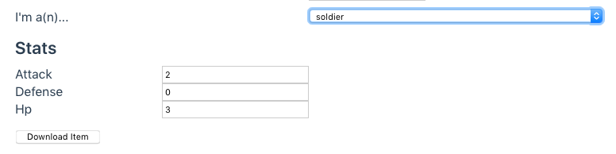

## Item Builder

<item-builder/>

## How to Use

### The Builder

The item builder always has the following sections:

1.  **Name** - The human-readable name of this item.
1.  **Icon** - A .png file to serve as the in-game icon for this item.
1.  **GUID** - An internal "globally unique identifier," or GUID, for this item. Created automatically, but you can generate a new one by pressing the button.
1.  **Description** - Text description of this item to be displayed to the player.
1.  **Uses** - Times this item can be used before it breaks. Set to -1 to make it unbreakable.
1.  **Value** - The in-game currency value of this item.
1.  **Item Type** - Each item can have some extra stats according to its Type. Select its Type here.

The stats section changes depending on the selected item Type. Here's what it looks like for the Soldier type:

### Exporting to Unity

When you're ready to see your item in-game:

1.  Hit "Download Item." You'll start downloading a zip file of the item.
1.  Drag this zip file to `[your White Mask location]/Assets/Resources/items`.
1.  Unzip the dragged file and remove the old zip file.

That's it!
