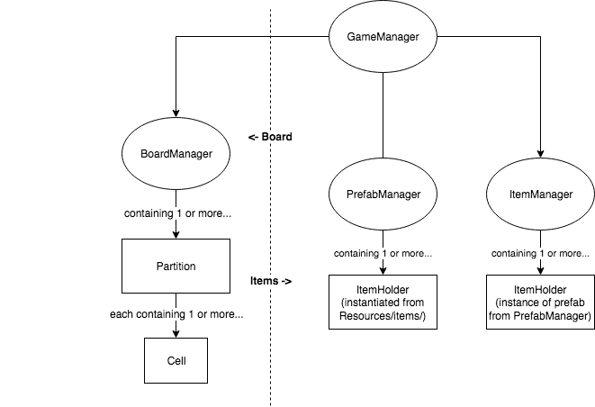

# Level

When a player selects a mural to hack, they've started a new _Level_.

## Construction

When a new White Mask level starts, it runs through the following procedure in GameManager’s `Start` function:

1.  Find the Keep Alive object in the scene. Save its level as the level to build.
    -   If there is no Keep Alive object, return to the Main Menu.
1.  Instantiate each Partition in the level.
1.  For each Partition…
    -   ...instantiate each Cell.

## Organization

