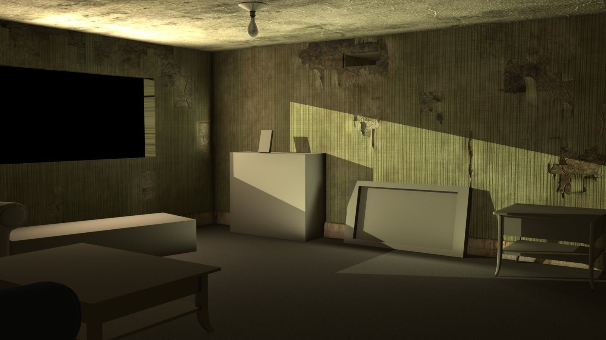
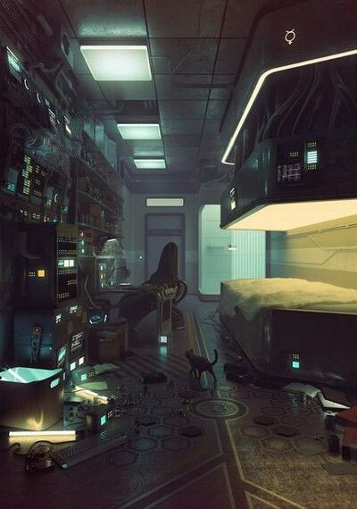
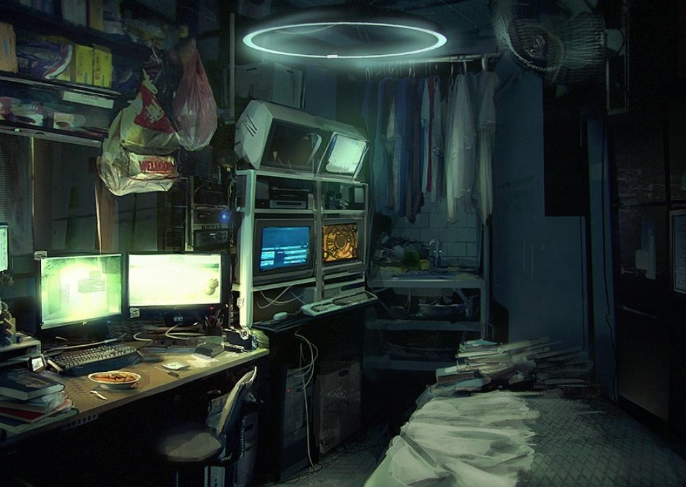
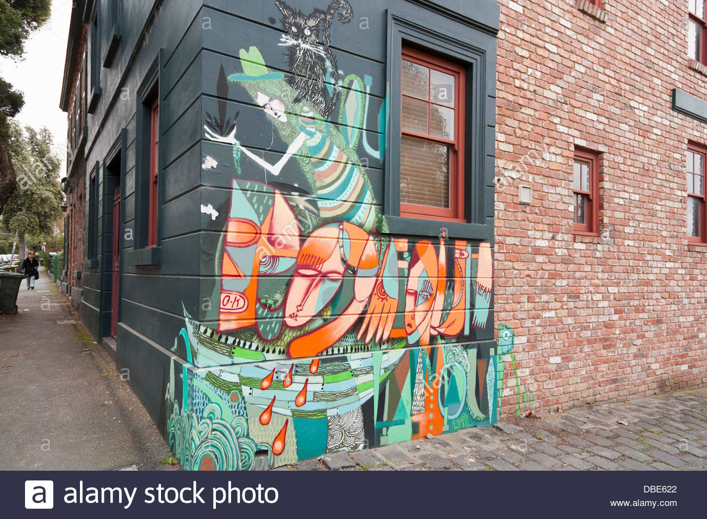
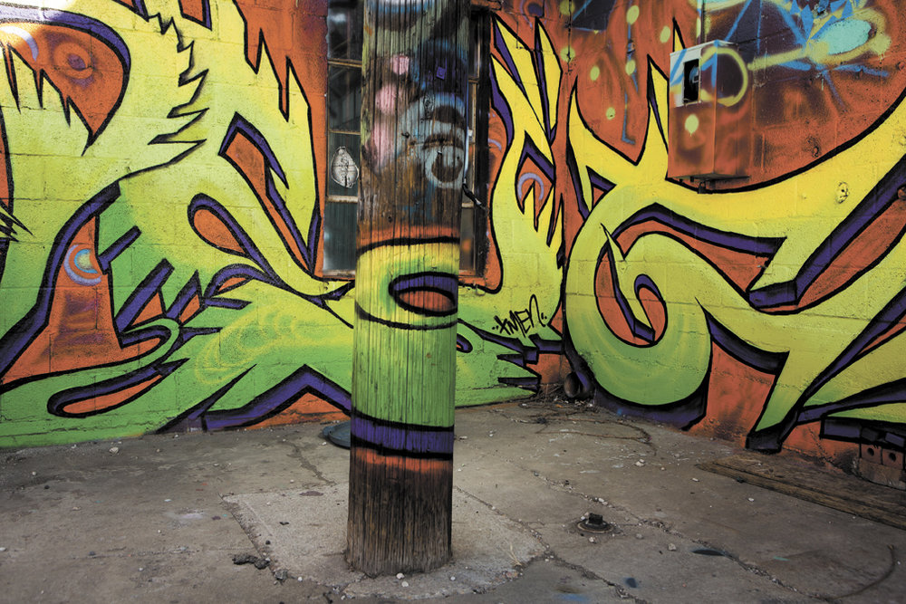
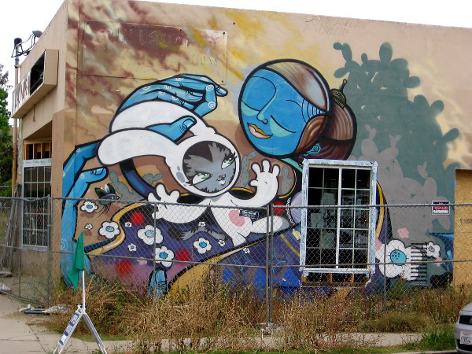

# Main Overview

_The White Mask_ is split up into two main sections:

-   **Management**, where the player manages their resources, reads news and interacts with messages from the outside world, selects the jobs they'll be taking, and tracks their progress toward achievements and story markers, and
-   **Hacking**, where a player is actively testing a mural, using/losing/improving materials from their inventory, and acquiring new materials.

## Gameplay Types

### Management

Management gameplay takes place in the player's apartment, a small, run-down room made as cozy as possible by the player. (Decorations will slowly build up, _Dishonored 2_ style, as the player completes threads of the story.)

The apartment may start like this:

and progress into something like this:

### Hacking

Hacking gameplay will take place at several locations throughout the world; all will focus on a mural on some kind of surface (wall, floor, ceiling, art installation, etc), so the player will control a drone hovering around that mural.

The player will have strict boundaries to where they can move the drone in order to save on 3d scene costs.

## A Typical Game Session

### Starting the Game and Accepting a Job (Management)

The player starts up _The White Mask_ from Steam, itch.io, or an executable. Production company logos fade in and out. The scene fades in on the apartment of the last player to play the game, including their custom decorations and their locations; white noise (rain, light thunder, a fan blowing) and the hum of computers are the only sound.

The player clicks "Continue" on the main menu and their POV zooms into their computer screen. They see a news ticker and two unread emails; they click on the mail icon to open their email client.

The first message is an email from a friend sending them some homemade software upgrades, which the player can apply to their Soldiers as desired. The second message is from a potential client in Kuala Lumpur; the client describes their situation and the player is given a list of rewards.

The rewards include:

-   A signing bonus for accepting the job
-   A list of reputation changes the player will experience from taking the job
-   A bonus for completing the job successfully

The player accepts the job and dispatches a drone to Kuala Lumpur. Timescale speeds up as the drone is in transit and returns to normal when it arrives. When it arrives, it presents a "START LEVEL" button and the player clicks it.

### Playing a Level (Hacking)

The drone's video feed flickers into life on the player's computer screen, which zooms in to take up the full viewport.

**TODO: Continue level flow here**
